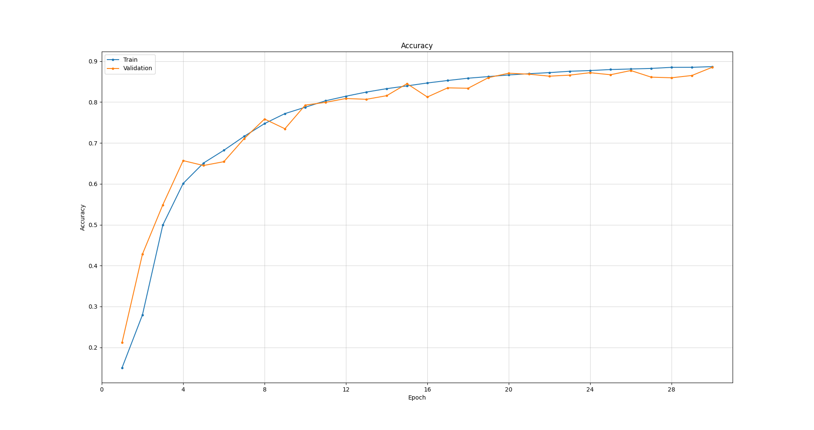
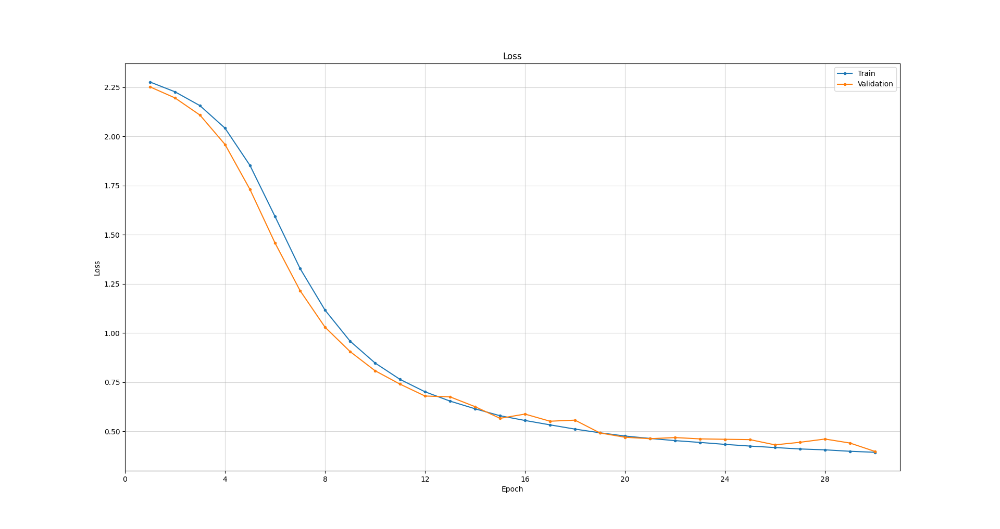

# Neural Net Using NumPy

This project is an implementation of a simple neural network with two hidden layers, made specifically to classify digits in the MNIST dataset. Only NumPy can be used when performing the computations required by the network.

For the complete technical overview see [link](https://github.com/Keith-Dao/Neural-Net-From-Scratch/blob/main/README.md).

## 1. Setup

To set up the project:

If you are running a linux system:

1. Alter the values of `python` and `pip` of the makefile to suit your system.
2. Run `make .env`
3. Run `. .env/bin/activate`
4. Run `make install`

Otherwise:

1. Create and activate a python virtual environment, follow [link](https://docs.python.org/3/tutorial/venv.html#creating-virtual-environments) for instructions
2. Install the packages using `pip install -r requirements.txt`
3. Install the local packages using `pip install -e .`

## 2. Configuration

To run the driver file:

- Update the existing `config.yaml` file

**OR**

- Create a yaml file with the following template:

```yaml
---
# Data
train_path: # Training image path
train_validation_split: # Training validation split
test_path: # Test image path
file_formats:# File formats as a list
  # - .png
  # - .jpg
batch_size: # Batch size

# Training
epochs: # Training epochs
learning_rate: # Learning rate

# Model
model_path: # Model load path

# Metrics
train_metrics:# Training metrics as a list
  # - loss
validation_metrics:# Validation metrics as a list
  # - loss
test_metrics:# Testing metrics as a list
  # - loss
```

### 2.1. Data Configuration

**train_path**: string

- The path to the training images
- Can be a relative or absolute path
- Optional, skips training if not provided

---

**train_validation_split**: float

- The training data split
- Must be in the range [0, 1]
- If 0, all data will be used for validation
- If 1, all data will be used for training
- Optional, defaults to 0.7

---

**test_path** str

- The path to the testing images
- Can be a relative or absolute path
- Optional, skips test inferencing if not provided

---

**file_formats**: list[str]

- File formats to be included as part of the dataset
- Must include "." as part of the value i.e. ".png" is valid but "png" is not valid
- Optional, defaults to only include ".png"

---

**batch_size**: int

- The batch size to load the training and test data
- Must be an positive integer
- Optional, defaults to 1

### 2.2. Training configuration

**epochs**: int

- The number of epochs to train the model
- Must be an positive integer
- Optional, defaults to 1

---

**learning_rate**: float

- The learning rate to train the model
- Must be a positive number
- Optional, defaults to 1.0e-4

### 2.3. Model

**model_path**: string

- The path to the saved model attributes to load
- Can be a relative or absolute path
- Optional, defaults to untrained model

### 2.4. Metrics

Valid metrics include:

- loss
- accuracy
- precision
- recall
- f1_score

**NOTE**:

- The selected metrics must exactly match the above
- Only following metrics will be visualised as a history graph:
  - loss
  - accuracy

---

**train_metrics**: list[str]

- Metrics to track during training
- Only accepts the valid metrics listed above
- Optional, defaults to no metrics if none are provided

---

**validation_metrics**: list[str]

- Metrics to track during validation
- Only accepts the valid metrics listed above
- Optional, defaults to no metrics if none are provided

---

**test_metrics**: list[str]

- Metrics to track during testing
- Only accepts the valid metrics listed above
- Optional, defaults to no metrics if none are provided and skips testing

## 3. Usage

After following the steps listed in [Setup](#1-setup) and [Configuration](#2-configuration), run the driver script with the following:

```
python main.py [-p] [config_file]
```

### 3.1. Arguments:

**config_file**:

- The path the config file
- If omitted, the script will default to searching for `config.yaml` in the current working directory

**-p** or **--prediction-mode**:

- When present, the driver script will skip all training and testing to the prediction mode to perform prediction on individual images
- If omitted, training and testing will be commenced

### 3.2. Prediction mode

- Only supported by models that have stored the classes, which included trained models or loaded pre-trained models
- Only files formats listed in the configuration file will be processed

## 4. Remarks

### 4.1. Results

Training with a learning rate of `5.0e-3` over 30 epochs with a 70% train validation split and batch size of 256, resulted in the following test metrics.

| Loss   | Accuracy |
| ------ | -------- |
| 0.3799 | 0.8893   |

| Class | Precision | Recall | F1 score |
| ----- | --------- | ------ | -------- |
| 0     | 0.9244    | 0.9612 | 0.9425   |
| 1     | 0.9274    | 0.9797 | 0.9529   |
| 2     | 0.8439    | 0.8905 | 0.8666   |
| 3     | 0.8459    | 0.8970 | 0.8707   |
| 4     | 0.8925    | 0.8880 | 0.8903   |
| 5     | 0.8770    | 0.7836 | 0.8277   |
| 6     | 0.8980    | 0.9280 | 0.9127   |
| 7     | 0.9114    | 0.8901 | 0.9006   |
| 8     | 0.9012    | 0.7957 | 0.8451   |
| 9     | 0.8692    | 0.8563 | 0.8627   |

The following are the training and validation histories for accuracy and loss respectively.

| Accuracy history                              | Loss history                          |
| --------------------------------------------- | ------------------------------------- |
|  |  |

From the test metric, it is evident that the model generalises fairly well for all the classes. The history graphs do not display any signs of overfitting or underfitting. From experiments with larger learning rates, the model begins to overfit on the training data, whereas a smaller learning rate would take more epochs to converge. A momentum optimizer would help in this case but is out of scope for this project.

Additionally, the usage of NumPy for the implementation greatly limits the model's training speed as NumPy does not support GPU computation.
